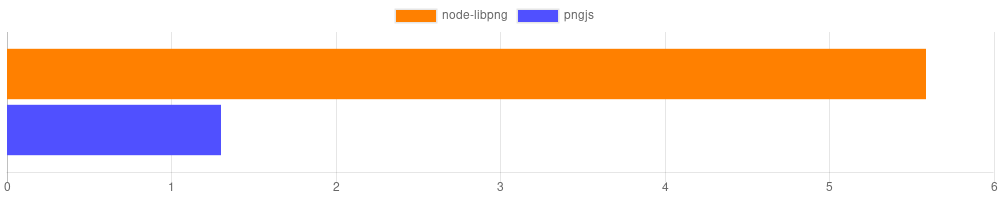
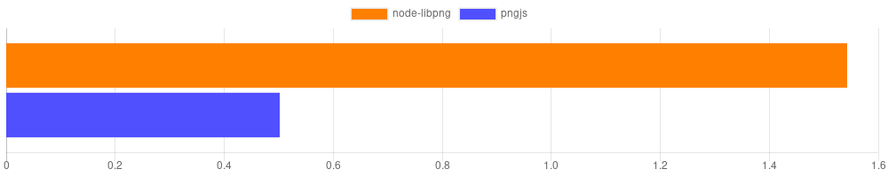
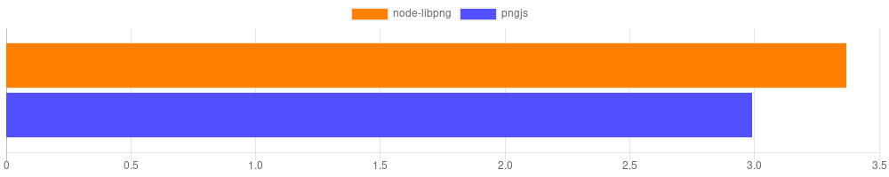

# node-libpng

[](https://www.npmjs.com/package/node-libpng)
[](https://travis-ci.org/Prior99/node-libpng)
[](https://ci.appveyor.com/project/Prior99/node-libpng/branch/master)
[](https://coveralls.io/github/Prior99/node-libpng?branch=master)

Unofficial bindings for node to libpng.

Please also refer to the **[Documentation](https://prior99.github.io/node-libpng/docs/index.html)**.

## Table of contents

 * [node-libpng](#node-libpng)
    * [Table of contents](#table-of-contents)
    * [Supported environments](#supported-environments)
    * [Usage](#usage)
       * [Reading (Decoding)](#reading-decoding)
           * [Reading PNG files using Promises](#reading-png-files-using-promises)
           * [Reading PNG files using a callback](#reading-png-files-using-a-callback)
           * [Reading PNG files synchroneously](#reading-png-files-synchroneously)
           * [Decoding a buffer](#decoding-a-buffer)
        * [Writing (Encoding)](#writing-encoding)
           * [Writing PNG files using Promises](#writing-png-files-using-promises)
           * [Writing PNG files using a callback](#writing-png-files-using-a-callback)
           * [Writing PNG files synchroneously](#writing-png-files-synchroneously)
           * [Encoding into a Buffer](#encoding-into-a-buffer)
        * [Accessing the pixels](#accessing-the-pixels)
           * [Accessing in the image's color format](#accessing-in-the-images-color-format)
           * [Accessing in rgba format](#accessing-in-rgba-format)
        * [Modifying the image](#modifying-the-image)
           * [Cropping](#cropping)
           * [Resizing the canvas](#resizing-the-canvas)
           * [Copying an image into another image](#copying-an-image-into-another-image)
           * [Filling an area with a specified color](#filling-an-area-with-a-specified-color)
           * [Setting a single pixel](#setting-a-single-pixel)
    * [Benchmark](#benchmark)
       * [Read access (Decoding)](#read-access-decoding)
       * [Write access (Encoding)](#write-access-encoding)
       * [Pixel access](#pixel-access)
    * [Contributing](#contributing)
       * [Generating the libpng config](#generating-the-libpng-config)
    * [Contributors](#contributors)

## Supported environments

This is a native Addon to NodeJS which delivers prebuilt binaries. Only some environments are supported:

| Node Version       | Windows 64-Bit     | Windows 32-Bit     | Linux 64-Bit       | Linux 32-Bit | OSX                |
|--------------------|--------------------|--------------------|--------------------|--------------|--------------------|
| Earlier            | ✗                  | ✗                  | ✗                  | ✗            | ✗                  |
| Node 10 *(Abi 64)* | ✓                  | ✓                  | ✓                  | ✗            | ✓                  |
| Node 11 *(Abi 67)* | ✓                  | ✓                  | ✓                  | ✗            | ✓                  |
| Node 11 *(Abi 72)* | ✓                  | ✓                  | ✓                  | ✗            | ✓                  |

## Usage

### Reading (Decoding)

Multiple ways of reading and decoding PNG encoded images exist:

 * [readPngFile](https://prior99.github.io/node-libpng/docs/globals.html#readpngfile) Reads a PNG file and returns a [PngImage](https://prior99.github.io/node-libpng/docs/classes/pngimage.html) instance with the decoded data.
    * The function can take an optional argument for using a node-style callback API. [Example](#reading-png-files-using-a-callback)
    * The function will return a Promise when not providing a callback. [Example](#reading-png-files-using-promises)
 * [readPngFileSync](https://prior99.github.io/node-libpng/docs/globals.html#readpngfilesync) Will read a PNG file synchroneously and return a [PngImage](https://prior99.github.io/node-libpng/docs/classes/pngimage.html) instance with the decoded image. [Example](#reading-png-files-synchroneously)
 * [decode](https://prior99.github.io/node-libpng/docs/globals.html#decode) Will decode a Buffer of raw PNG file data and return a [PngImage](https://prior99.github.io/node-libpng/docs/classes/pngimage.html) instance. [Example](#decoding-a-buffer)

#### Reading PNG files using Promises

In order to use the Promise-based API, simply omit the third argument.

```typescript
import { readPngFile } from "node-libpng";

async function readMyFile() {
    const image = await readPngFile("path/to/image.png");
    console.log(`Reading was successful. The dimensions of the image are ${image.width}x${image.height}.`);
}
```

If an error occured while reading the file or decoding the buffer, the Promise which `writePngFile` returns will reject with the error.

#### Reading PNG files using a callback

In order to use the callback-based API, simply provide a callback as the third argument.

```typescript
import { readPngFile } from "node-libpng";

function readMyFile() {
    readPngFile("path/to/image.png", (error, image) => {
        if (error !== null) {
            // TODO: Check what `error` contains.
        }
        console.log(`Reading was successful. The dimensions of the image are ${image.width}x${image.height}.`);
    });
}
```

If an error occured while reading the file or decoding the buffer, it will be passed as the first argument to the callback.
Otherwise `null` will be passed. The [PngImage](https://prior99.github.io/node-libpng/docs/classes/pngimage.html) instance will be passed as the second argument. If an error occured,
it will be `undefined`.

#### Reading PNG files synchroneously

It is possible to read the image from the disk in a blocking way, using Node's `readFileSync`:

```typescript
import { readPngFileSync } from "node-libpng";

function readMyFile() {
    const image = readPngFileSync("path/to/image.png");
    console.log(`Reading was successful. The dimensions of the image are ${image.width}x${image.height}.`);
}
```

If an error occured while reading the file or decoding the buffer, it will be `throw`n.

#### Decoding a buffer

Buffers can be decoded directly into a [PngImage](https://prior99.github.io/node-libpng/docs/classes/pngimage.html) instance:

```typescript
import { decode } from "node-libpng";

function decodeMyBuffer() {
    const buffer = ...; // Some buffer containing the raw PNG file's data.
    const image = decode(buffer);
    console.log(`Decoding was successful. The dimensions of the image are ${image.width}x${image.height}.`);
}
```

If an error occured while decoding the buffer, it will be `throw`n.
The decoding happens synchroneously.

### Writing (Encoding)

Multiple ways for encoding and writing raw image data exist:

 * [writePngFile](https://prior99.github.io/node-libpng/docs/globals.html#writepngfile) Writes the raw data into a PNG file using Promises or a callback.
    * The function can take an optional argument for using a node-style callback API. [Example](#writing-png-files-using-a-callback)
    * The function will return a Promise when not providing a callback. [Example](#writing-png-files-using-promises)
 * [writePngFileSync](https://prior99.github.io/node-libpng/docs/globals.html#writepngfilesync) Writes the raw data into a PNG file synchroneously. [Example](#writing-png-files-synchroneously)
 * [encode](https://prior99.github.io/node-libpng/docs/globals.html#encode) Encodes the raw data into a Buffer containing the PNG file's data. [Example](#encoding-into-a-buffer)
 * [PngImage](https://prior99.github.io/node-libpng/docs/classes/pngimage.html) contains methods for encoding and writing modified image data:
    * [PngImage.encode](https://prior99.github.io/node-libpng/docs/classes/pngimage.html#encode) The same as calling the free function [encode]() with `PngImage.data`.
    * [PngImage.write](https://prior99.github.io/node-libpng/docs/classes/pngimage.html#write) The same as calling the free function [writePngFile]() with `PngImage.data`.
    * [PngImage.writeSync](https://prior99.github.io/node-libpng/docs/classes/pngimage.html#writesync) The same as calling the free function [writePngFileSync]() with `PngImage.data`.

#### Writing PNG files using Promises

In order to use the Promise-based API, simply omit the 4th argument.

```typescript
import { writePngFile } from "node-libpng";

async function writeMyFile() {
    // Let's write a 100x60 pixel PNG file.
    const imageData = Buffer.alloc(100 * 60 * 3);
    // TODO: Manipulate the image data somehow.
    const options = {
        width: 100,
        height: 60
    };
    await writePngFile("path/to/image.png", imageData, options);
    console.log("File successfully written.");
}
```

In this example, a 100x60 pixel image will be encoded and written to disk.
Based on the length of the buffer and the provided dimensions the presence of an alpha channel will be automatically calculated.

It is possible to omit either `width` or `height` from the options.

If an error occured while writing the file or encoding the buffer, the Promise which `writePngFile` returns will
reject with the error.

#### Writing PNG files using a callback

In order to use the callback-based API, provide a callback as the 4th argument.

```typescript
import { writePngFile } from "node-libpng";

function writeMyFile() {
    // Let's write a 100x60 pixel PNG file.
    const imageData = Buffer.alloc(100 * 60 * 3);
    // TODO: Manipulate the image data somehow.
    const options = {
        width: 100,
        height: 60
    };
    await writePngFile("path/to/image.png", imageData, options, (error) => {
        if (error !== null) {
            // TODO: Check what `error` contains.
        }
        console.log("File successfully written.");
    });
}
```

In this example, a 100x60 pixel image will be encoded and written to disk.
Based on the length of the buffer and the provided dimensions the presence of an alpha channel will be automatically calculated.

It is possible to omit either `width` or `height` from the options.

If an error occured while writing the file or encoding the buffer, it will be passed as the first and only argument
in the callback. Otherwise `null` will be passed.

#### Writing PNG files synchroneously

It is possible to write the image to disk in a blocking way, using Node's `writeFileSync`:

```typescript
import { writePngFileSync } from "node-libpng";

function writeMyFile() {
    // Let's write a 100x60 pixel PNG file.
    const imageData = Buffer.alloc(100 * 60 * 3);
    // TODO: Manipulate the image data somehow.
    const options = {
        width: 100,
        height: 60
    };
    writePngFileSync("path/to/image.png", imageData, options);
    console.log("File successfully written.");
}
```

In this example, a 100x60 pixel image will be encoded and written to disk.
Based on the length of the buffer and the provided dimensions the presence of an alpha channel will be automatically calculated.

It is possible to omit either `width` or `height` from the options.

If an error occured while writing the file or encoding the buffer, it will be `throw`n.

#### Encoding into a Buffer

Buffers can be encoded directly from a buffer containing the raw pixel data:

```typescript
import { encode } from "node-libpng";

function encodeMyBuffer() {
    const buffer = ...; // Some buffer containing the raw pixel data.
    const options = {
        width: 100,
        height: 100
    };
    const encodedPngData = encode(buffer);
    // The Buffer `encodedPngData` now contains the raw PNG-encoded data.
    console.log("File successfully encoded.");
}
```

Based on the length of the buffer and the provided dimensions the presence of an alpha channel will be automatically calculated.
If an error occured while encoding the buffer, it will be `throw`n.
The encoding happens synchroneously.

### Accessing the pixels

PNG specifies five different types of colors:

 * [Gray Scale](https://prior99.github.io/node-libpng/docs/enums/colortype.html#gray_scale)
 * [Gray Scale with Alpha channel](https://prior99.github.io/node-libpng/docs/enums/colortype.html#gray_scale_alpha)
 * [Palette (Indexed)](https://prior99.github.io/node-libpng/docs/enums/colortype.html#palette)
 * [RGB](https://prior99.github.io/node-libpng/docs/enums/colortype.html#rgb)
 * [RGB with Alpha channel](https://prior99.github.io/node-libpng/docs/enums/colortype.html#rgba)

In the [PngImage.data](https://prior99.github.io/node-libpng/docs/classes/pngimage.html#data) buffer the colors are stored
the way they were encoded in the PNG image. This library provides utilities for accessing the pixels in both the native format
as well as rgba format.

#### Accessing in the image's color format

In order to retrieve the color in the image's native format at a given position [PngImage.at](https://prior99.github.io/node-libpng/docs/classes/pngimage.html#at)
can be used.

##### Example for a gray scale image

```typescript
import { readPngFileSync } from "node-libpng";

const image = readPngFileSync("path/to/grayscale-image.png");
const color = image.at(10, 10);
const colorType = image.colorType;
// Will log: "The color type of the image is gray-scale. Pixel at 10,10 is of color 168."
console.log(`The color type of the image is ${colorType}. Pixel at 10,10 is of color ${color.join(", ")}.`);
```

##### Example for a rgb image:

```typescript
const image = readPngFileSync("path/to/rgb-image.png");
const color = image.at(10, 10);
const colorType = image.colorType;
// Will log: "The color type of the image is rgb. Pixel at 10,10 is of color 100, 150, 200."
console.log(`The color type of the image is ${colorType}. Pixel at 10,10 is of color ${color.join(", ")}.`);
```
Dealing with all of these different color formats can be quite irritating. A set of conversion utilities as for example
a utility for converting any color format to rgba ([convertToRGBA](https://prior99.github.io/node-libpng/docs/globals.html#converttorgba)) exist.

[It is also possible to do this automatically](#accessing-in-rgba-format).

#### Accessing in rgba format

A method for retrieving the automatically converted color exists: [PngImage.rgbaAt](https://prior99.github.io/node-libpng/docs/classes/pngimage.html#rgbaat).

It will convert any color into rgba format. Unlike [other implementations](https://www.npmjs.com/package/pngjs#pngjs), all color formats are supported.

```typescript
const image = readPngFileSync("path/to/any-color-format-image.png");
const color = image.rgbaAt(10, 10);
const colorType = image.colorType;
// Will log: "The color type of the image is palette. Pixel at 10,10 is of color 100, 150, 200, 255."
console.log(`The color type of the image is ${colorType}. Pixel at 10,10 is of color ${color.join(", ")}.`);
```

### Modifying the image

Several basic utilities for modifying an image exist.

#### Cropping

A simple utility for cropping an image to a sub-rectangle exists: [PngImage.crop](https://prior99.github.io/node-libpng/docs/classes/pngimage.html#crop). It's a simplified version of [PngImage.resizeCanvas](https://prior99.github.io/node-libpng/docs/classes/pngimage.html#resizecanvas).

It will reduce the image in-place to the specified rectangle:

```typescript
import { readPngFileSync, rect } from "node-libpng";

const image = readPngFileSync("path/to/image.png");
image.crop(rect(10, 10, 100, 100));
// Will log: "New dimensions: 100x100".
console.log(`New dimensions: ${image.width}x${image.height}.`);
```

#### Resizing the canvas

Use [PngImage.resizeCanvas](https://prior99.github.io/node-libpng/docs/classes/pngimage.html#resizecanvas) for advanced cropping operations.

Take a look at [ResizeCanvasArguments](https://prior99.github.io/node-libpng/docs/interfaces/resizecanvasarguments.html).

It takes a configuration object which makes it possible to provide:
 * An offset to the top left (a padding).
 * A fill color for uncovered regions.
 * A subrectangle of the image to use.
 * The new dimensions for the image.

In the following example, a 10 pixel margin is applied to the top and to the left and a 50x50 pixel area is copied from the image at offset 20,20.
The image is resized to 100x100, so a 40 pixel margin will exist to the right and to the bottom. The background is filled in red:

```typescript
import { readPngFileSync, rect, xy, colorRGB } from "node-libpng";

const image = readPngFileSync("path/to/image.png");
image.resizeCanvas({
    offset: xy(10, 10),
    clip: rect(20, 20, 50, 50),
    dimensions: xy(100, 100),
    fillColor: colorRGB(255, 0, 0),
});
// Will log: "New dimensions: 100x100".
console.log(`New dimensions: ${image.width}x${image.height}.`);
```

#### Copying an image into another image

Use [PngImage.copyFrom](https://prior99.github.io/node-libpng/docs/classes/pngimage.html#copyfrom) to copy an area of one image into another one:

```typescript
import { readPngFileSync, xy, rect } from "node-libpng";

const source = readPngFileSync("path/to/source-image.png");
const target = readPngFileSync("path/to/target-image.png");

target.copyFrom(source, xy(10, 10), rect(100, 100, 50, 50));
```

The above example will copy a 50x50 rectangle from the source image at position 100,100 to the target image at position 10,10.
The offset and the subrectangle can be omitted to copy the whole source image to the top left corner of the target image.

#### Filling an area with a specified color

Use [PngImage.fill](https://prior99.github.io/node-libpng/docs/classes/pngimage.html#fill) to fill an area with a specified color:

```typescript
import { readPngFileSync, colorRGB, rect } from "node-libpng";

const image = readPngFileSync("path/to/source-image.png");
// Change a 100x100 pixel area at offset 10,10 to red:
image.fill(colorRGB(255, 0, 0), rect(10, 10, 100, 100));
```

#### Setting a single pixel

With [PngImage.set](https://prior99.github.io/node-libpng/docs/classes/pngimage.html#set) an individual pixel's color can be changed:

```typescript
import { readPngFileSync, colorRGB, xy } from "node-libpng";

const image = readPngFileSync("path/to/source-image.png");
// Change the pixel at 10,10 to red:
image.set(colorRGB(255, 0, 0), xy(10, 10));
```

## Benchmark

As it is a native addon, **node-libpng** is much faster than libraries like [pngjs](https://www.npmjs.com/package/pngjs):

### Read access (Decoding)

The chart below shows the comparison of decoding an image between [pngjs](https://www.npmjs.com/package/pngjs) (sync api) and **node-libpng**.
The time to fully decode a 4096x4096 image is measured (Higher is better).



*(The x-axis scale shows the amount of fully decoded images per second.)*

### Write access (Encoding)

The chart below shows the comparison of encoding an image between [pngjs](https://www.npmjs.com/package/pngjs) (sync api) and **node-libpng**.
The time to fully encode a 4096x4096 image is measured (Higher is better).



*(The x-axis scale shows the amount of fully encoded images per second.)*

### Pixel Access

The chart below shows the comparison of accessing all pixels in a decoded image between [pngjs](https://www.npmjs.com/package/pngjs) and **node-libpng**.
The time to fully access every pixel in the raw data is measured (Higher is better).



*(The x-axis scale shows the amount of fully accessed images per second.)*

## Contributing

Yarn is used instead of npm, so make sure it is installed, probably: `npm install -g yarn`.

Generally, it should be enough to just run:

```
make
```

which will install all node dependencies, compile the dependencies and C++ code,
compile typescript, execute all test, lint the sources and build the docs.

### Generating the libpng config

Libpng requires an OS specific configuration headerfile `pnglibconf.h`.
This can be generated by executing:

```
git submodule update --init --recursive
cd deps/libpng
mkdir build
cd build
cmake ..
make
cp pnglibconf.h ../../config/linux/
```

## Contributors

 - Frederick Gnodtke
